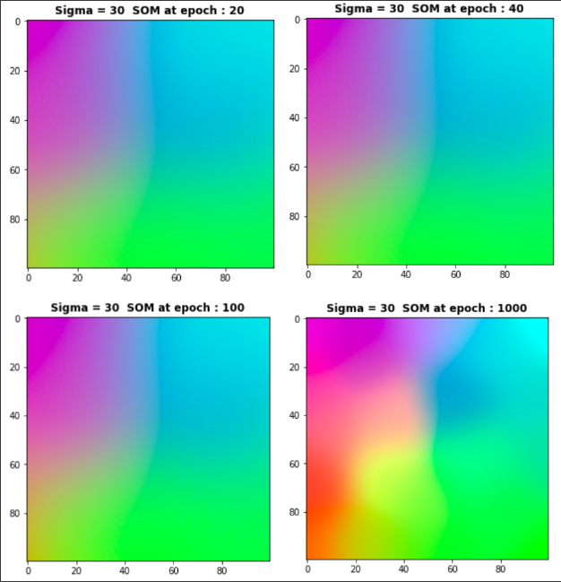

# Self_Organizing_Maps

#### Developing Kohonen Self organizing maps algorithm from scratch in python.

### Introduction
A Self-organizing Map is a data visualization technique developed in the early 1980's. SOMs map multidimensional data onto lower dimensional subspaces where geometric relationships between points indicate their similarity.

To better understand SOM and the mathematics behind it, please refer to [SOM](https://www.cs.hmc.edu/~kpang/nn/som.html)

### Sample Output obtained:

##### Requirements:
* Numpy
* matplotlib

**NOTE : For ease of use and good documentation use ipynb version(contains markdowns to indacte what is being done) can be run directly using google colab and use .py file if you want to use python console.**

If used give credits by forking, staring or watching git hub repo or in some other way. Thank you:slightly_smiling_face:
